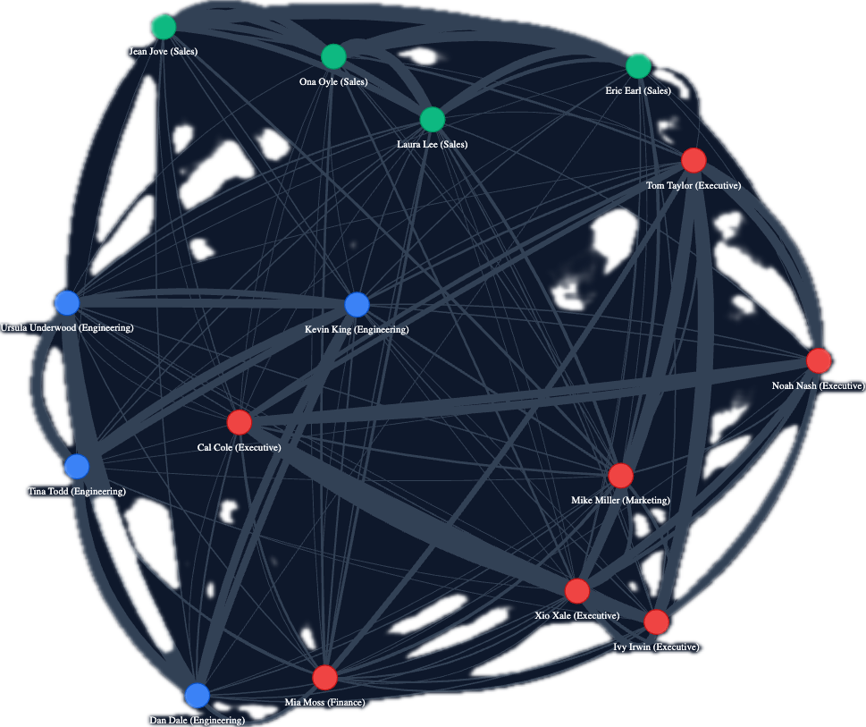

# AI Inspector: Relationship Intelligence

End-to-end graph data pipeline designed to ingest internal corporate communications, run complex algorithmic analytics (like Louvain clustering), and surface suspicious cross-department interaction metrics or insider threats instantly.



## Getting Started: End-to-End Demo

Follow these steps to generate fake organizational data, spin up the backend pipelines, ingest the interactions, and view the visualization!

### 1. Generate the Dataset
We have a native fake data generator designed to simulate large corporate networks with variable "cross-departmental" comms percentages.

```bash
cd event-data-generator
python3 -m venv venv
source venv/bin/activate
pip install -r requirements.txt

# Generate exactly 1000 events across 15 employees, with 19% happening cross-department
python3 -m src.generator --employees 15 --cross-dept-pct 19 --events 1000
```
*This places an `employees.json` and a timestamped `events_{datetime}.json` file into `event-data-generator/data/`.*

### 2. Run the Analytics Backbone
Our backend pipeline utilizes **Neo4j** (Graph Database), **Redis** (Idempotency Caching to prevent duplicate events), and **FastAPI**.

```bash
cd ../relationship-intel-app
docker compose up -d --build
```

### 3. Ingest Events
Push your shiny new generated `.json` events payload into the API. The API instantly dedupes entries and merges the nodes/edges into our Neo4j buckets.

*(Double-check your exact filename generated in Step 1!)*
```bash
curl -X POST http://localhost:8000/ingest \
  -H "Content-Type: multipart/form-data" \
  -F "file=@../event-data-generator/data/events_2026-04-22T09-45-35.json"
```

### 4. Experience the Visual Clusters
Pop open your browser and navigate to:
[http://localhost:8000](http://localhost:8000/)

The visualization engine will automatically pull the algorithmically calculated `cluster_id`s from our network routines and statically color-code related communities into force-directed physics nodes—exposing true behavioral teams beyond formal HR department labels!

***

### Useful Commands
**Resetting the Databases:**
If you want to clear your pipeline to generate different company sizes or cross-department ratios:
```bash
docker compose down -v
docker compose up -d --build
```
